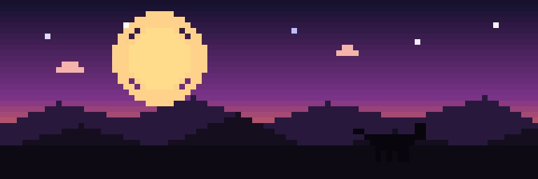

<h2 align="center">Hi there 👋 I'm Max</h2>

  

  I build software, 
  accessibility tools, automation, and web/app projects.

 

  <a href="https://www.sunriverconsulting.us/"><b>Company Website</b></a> 
  <a href="mailto:max.casteel.mso@gmail.com"><b>Email</b></a>
  <a href="https://www.linkedin.com/in/maximilian-casteel-10a623b5/"><b>Linkedin/b></a>

---

### What I’m working on
- **508-Agent**  PDF / 508 accessibility workflows + tooling
- **Vital Tails**  pet health tracking app (Android)

### What I care about
- shipping tools people can use
- automation that saves time
- good coding
---

  
<b>Activity</b>

   
  

    <picture>
      <source media="(prefers-color-scheme: dark)"
              srcset="https://raw.githubusercontent.com/Maximilian741/Maximilian741/output/snake-dark.svg" />
      
    </picture>
  

